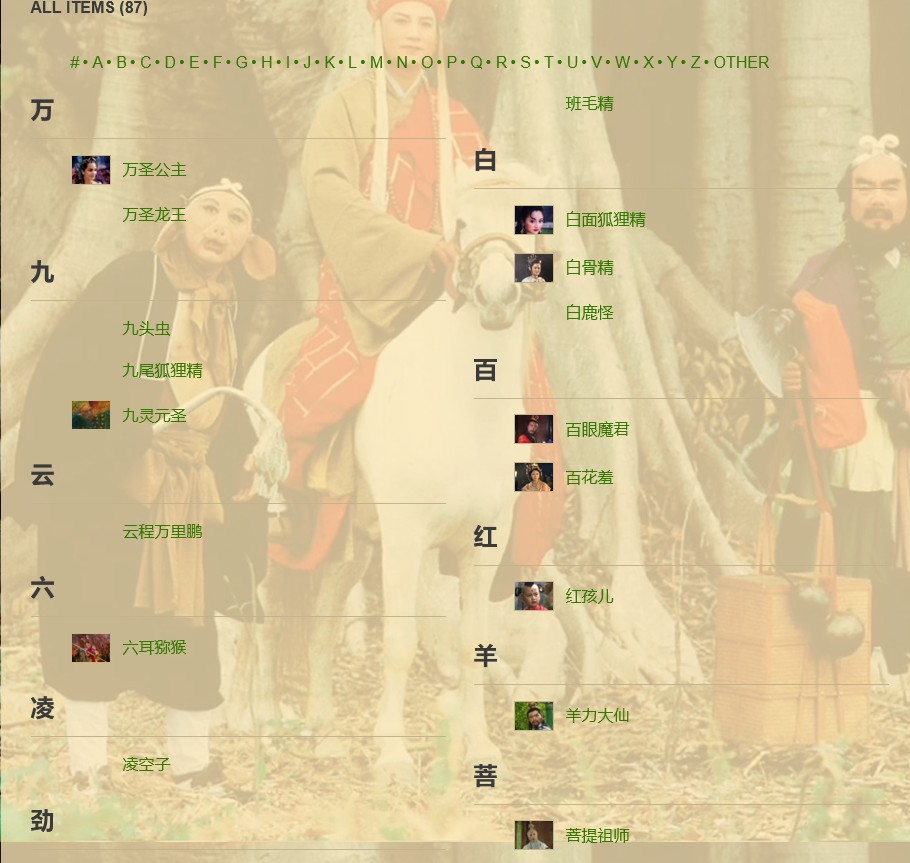
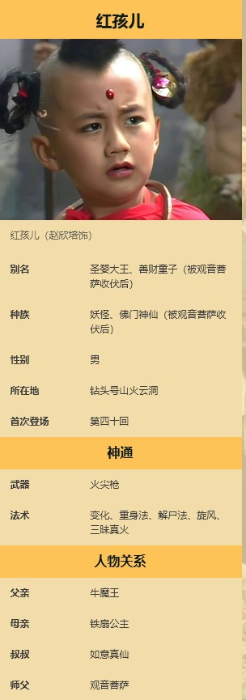

# 数据获取与预处理
该步骤利用爬虫技术从西游记中文维基网站上获取哈利·波特全文中出现的所有实体名称，以及多种特定的已知实体关系；并对获取的实体与实体关系进行预处理。以构建初步的知识图谱，并为之后的深度关系抽取做准备。

## 代码说明
- extract_raw_entities.py
  
    从西游记fandom维基网站 https://xiyouji.fandom.com/zh/wiki/ 出发，爬取所有实体名称。
    
- extract_raw_relations.py

  根据实体名称列表，逐条访问西游记fandom维基网站的半结构化数据，根据预定义的数据模板抽取已知的基本实体关系。
  
- re_wiki.py  
  
  从西游记维基百科 https://zh.wikipedia.org/wiki/西游记角色列表 中，获取到半结构化数据，利用正则表达式清洗出实体名称。

- clean_data.py
  整个各个网站上的实体、关系数据进行清理。包括去除缺失值，修改不符合规则的名称等。
## 数据文件说明
- entities_clean.txt

  获取到的所有人名实体名称。每行一个实体，总计461个实体。

- relations_clean.txt

  清理后的三元组，总计452条。作为西游记知识图谱的初步知识库。

## 从半结构化数据中获取所有实体名称

哈利·波特中文维基网站中的提供了所有实体名称，其存在形式为半结构化数据，数据页面如下图所示：



该页面的特点：
1. 链接为 https://xiyouji.fandom.com/zh/wiki/* 的形式，*表示某一实体类别。
2. 该类别的所有实体名称以字典序给出。

通过以预定义的实体类别为种子地址，可以获取部分实体名称。

## 从半结构化数据中获取三元组

西游记中文维基网站中的数据为半结构化数据，以实体红孩儿为例，其数据页面如下图所示：



该页面的特点：
1. 链接为 https://xiyouji.fandom.com/zh/wiki/* 的形式，*表示要查询的实体名称。
2. 主要关系数据以右侧的知识卡片形式给出。我们主要从中提取实体的家庭成员信息和从属关系信息。

从该页面提取到的三元组为：
```
红孩儿	叔叔	如意真仙
红孩儿	师父	观音菩萨
红孩儿	母亲	铁扇公主
红孩儿	父亲	牛魔王
```

## 数据清理
该步骤对之前获取到的数据中可能存在的错误文本，不规则信息进行清理。

错误文本实例：
```
火焰山
四御|四帝
白面狐狸精	父亲	白鹿怪（比丘国国丈）
```

上述文本的特点与处理方法：
1. 存在非人名实体。在用正则表达式清洗数据时，未清洗干净。处理方法为直接删除。
2. 实体关系中带有对实体的注释。处理方式是，剔取出来备份后删除。